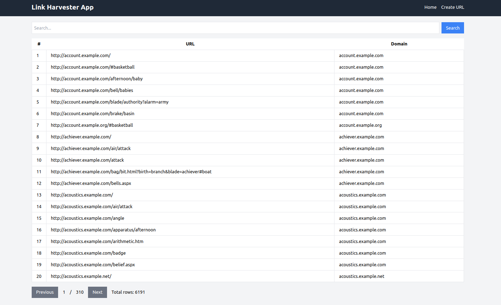
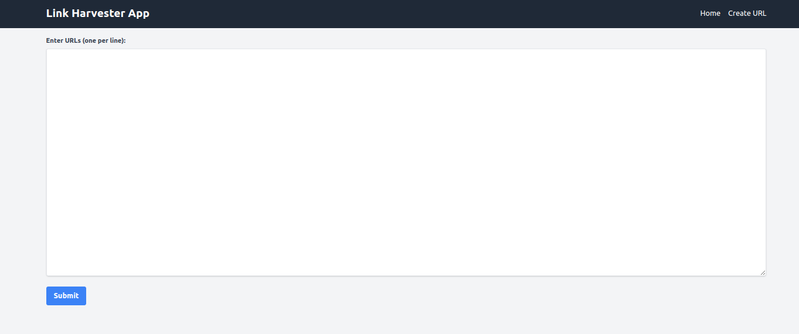

## Project installation instruction

### Demo

#### Home Page

#### URL Create Page

### Tools & Tech stack used
- Laravel 11 (back-end)
- Alpine.js 3 (front-end)
- Tailwind 2.2 CSS
- MySQL 8 (Database)
- Docker (nginx, php-fpm, mysql, redis, scheduler)

### Run Laravel Project
    git clone https://github.com/riad1302/link_harvester_app.git
    cd link_harvester_app/docker
    cp .env.example .env
    cp docker-compose.override.example.yml docker-compose.override.yml
    cd /.envs
    cp app.env.example app.env
    cp mysql.env.example mysql.env
    cp php-ini.env.example php-ini.env
    cp redis.env.example redis.env
    docker-compose build
    docker-compose up -d
    docker-compose exec -it app composer install
    docker-compose exec -it app php artisan key:generate
    docker-compose exec -it app php artisan migrate
    docker-compose exec -it app php artisan test
    docker-compose exec -it app php artisan db:seed

### Check Application
    http://localhost:8000/

